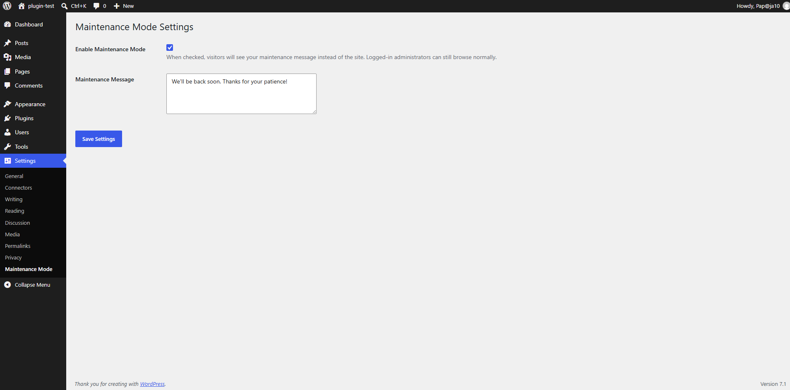
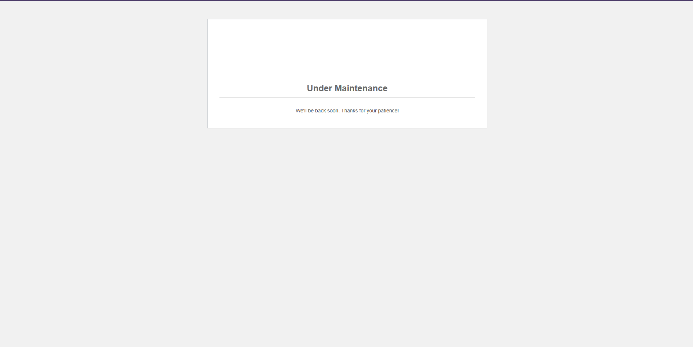

# Simple Maintenance Mode

A lightweight WordPress plugin that puts your site into maintenance mode 
with a custom message, while logged-in administrators can still browse 
the site normally.

## Features

- Toggle maintenance mode on/off from the WordPress admin
- Custom maintenance message, editable from Settings → Maintenance Mode
- Admins bypass the maintenance page automatically — only regular 
  visitors see it
- Returns a proper `503 Service Unavailable` HTTP status while enabled 
  (good practice for SEO — search engines know not to index the page 
  as your actual content)
- No database tables, no external dependencies — uses WordPress's 
  built-in options API

## Screenshots

**Admin settings page:**

**Visitor view when enabled:**

## Installation

1. Download `simple-maintenance-mode.php`
2. Upload it to your `wp-content/plugins/simple-maintenance-mode/` folder
3. Activate it from the Plugins page in your WordPress admin
4. Go to **Settings → Maintenance Mode** to enable it and set your message

## Built with

- Plain PHP using WordPress's Plugin API (hooks: `admin_menu`, 
  `admin_init`, `template_redirect`)
- WordPress Settings API for the admin form
- Output properly escaped (`esc_html`, `esc_attr`, `esc_textarea`) to 
  follow WordPress security best practices

## Why I built this

A portfolio project aimed at the kind of small, practical plugin work 
freelance WordPress clients actually ask for — built to demonstrate 
real WordPress plugin architecture, not just PHP syntax.
